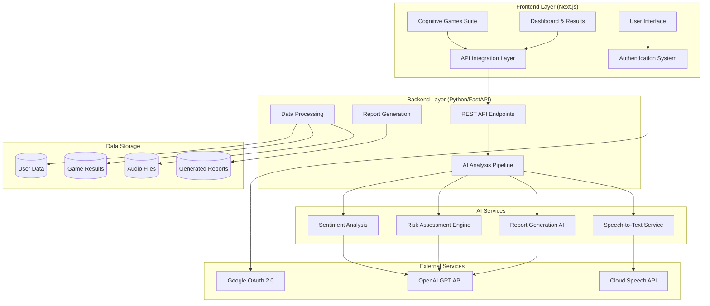

# Spark Mind - Dementia Early Detection System Architecture

## Overview

The Spark Mind system is a comprehensive web-based platform for early dementia detection through cognitive assessments. It combines four different cognitive games with AI-powered analysis to provide risk assessments and detailed reports.

## System Architecture

## Component Responsibilities

- **User Browser / Next.js UI**: Renders cognitive games and handles interactions.
- **SessionProvider / Auth**: Manages authentication context (NextAuth) for gating games and submissions.
- **Games UI**: Four assessment modalities (memory, stroop, word recall, speech capture).
- **Frontend API Client**: Lightweight abstraction using fetch for REST and multipart uploads.
- **FastAPI Backend**: Exposes assessment endpoints, routes audio to pipeline, serves generated artifacts.
- **AiAgent Pipeline**: Orchestrates speech transcription, sentiment, heuristic risk, and multi-agent report generation.
- **SpeechToText**: Whisper-based transcription and speech metrics extraction.
- **SentimentAnalyzer**: Offline-capable sentiment estimation with fallback.
- **Heuristic Risk Scoring**: Combines speech & sentiment features into probability + category (non-diagnostic).
- **CrewAI Agents**: Generate clinician-style PDF report, summary text, and user email text.
- **Outputs Storage**: Files persisted for retrieval (PDF, summary, metrics).
- **Model Cache**: Avoids re-downloading Whisper & sentiment models.
- **Future User DB**: Placeholder for per-user assessment history & personalization.

## Data Flow Summary
1. User plays a game (or records speech) → scores or audio captured.
2. Frontend API client sends JSON / multipart to FastAPI.
3. FastAPI invokes `run_pipeline` (with or without audio) → generates metrics & artifacts.
4. Pipeline stores artifacts (PDF, summary, email text, metrics JSON).
5. Frontend receives risk + PDF filename; can fetch the PDF via `/api/reports/{file}`.
6. (Future) Auth ties submissions to a user record for history.

## Sequence (Speech Assessment) - Textual
1. User clicks Start / Stop on Speech game → obtains `speech.webm` Blob.
2. Frontend uploads via `POST /api/assessment/speech` (multipart form-data).
3. FastAPI saves audio → calls pipeline → Whisper transcribes → metrics & risk computed.
4. CrewAI agents produce doctor report, summary, email; PDF generated.
5. Response returns `risk`, `pdf` filename, `summary excerpt`, `scores`.
6. UI displays risk and offers download link.

## Reliability / Next Steps
- Add async task queue if latency from report generation grows.
- Add caching or incremental updates for long audio streams.
- Persist per-user assessment history once DB is integrated.

*(This file serves as a readable fallback for environments where `.drawio` cannot be opened.)*
