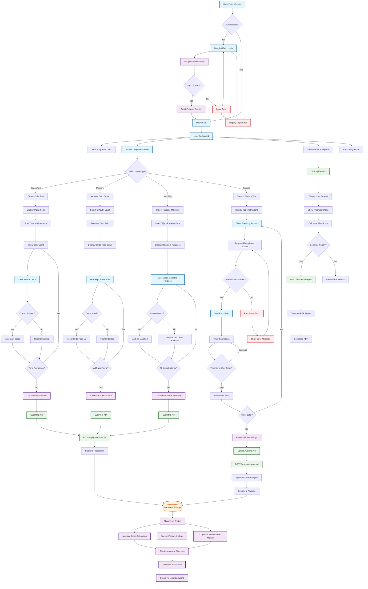
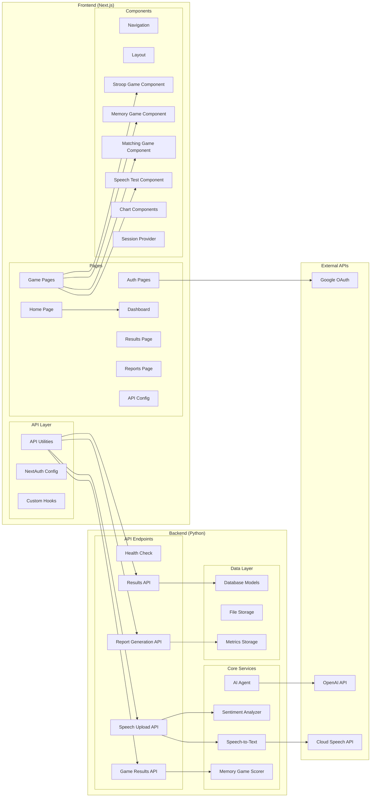
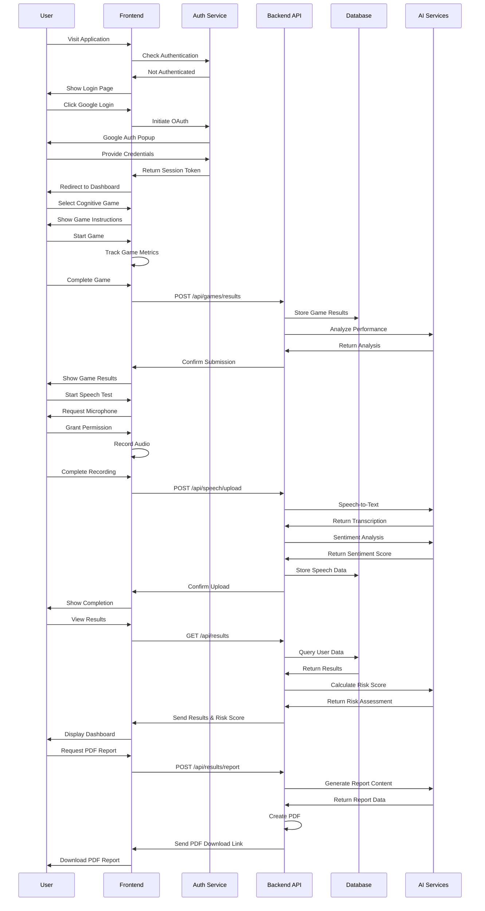
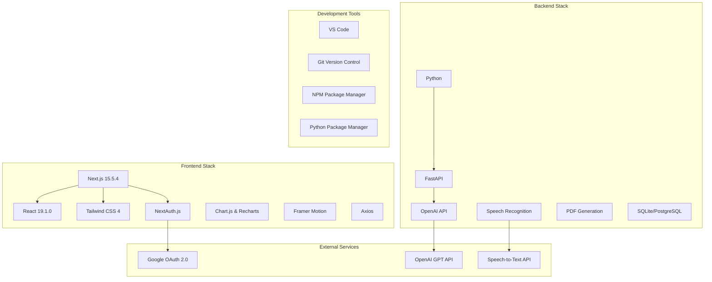

# Dementia Early Detection System - Project Flowchart

## Complete System Architecture Flow



## Detailed Component Architecture



## Data Flow Architecture



## Technology Stack Overview



## File Structure Overview

```
ForeKnow/
├── frontend/                    # Next.js Frontend Application
│   ├── src/
│   │   ├── app/                # App Router Pages
│   │   │   ├── page.js         # Home Page
│   │   │   ├── dashboard/      # Dashboard Pages
│   │   │   ├── games/          # Game Pages
│   │   │   │   ├── stroop/     # Stroop Color Test
│   │   │   │   ├── memory/     # Memory Game
│   │   │   │   ├── matching/   # Object-Purpose Matching
│   │   │   │   └── speech/     # Speech Fluency Test
│   │   │   ├── results/        # Results & Analytics
│   │   │   ├── reports/        # PDF Reports
│   │   │   └── auth/           # Authentication Pages
│   │   ├── components/         # Reusable Components
│   │   │   ├── games/          # Game Components
│   │   │   ├── ui/             # UI Components
│   │   │   └── charts/         # Chart Components
│   │   └── lib/                # Utilities & API
│   │       ├── api.js          # API Integration
│   │       ├── auth.js         # Authentication Config
│   │       └── utils.js        # Helper Functions
│   ├── public/                 # Static Assets (SVG Icons)
│   ├── docs/                   # Documentation
│   └── package.json            # Dependencies
├── backend/                    # Python Backend
│   ├── main.py                 # FastAPI Main Application
│   ├── AiAgent.py              # AI Analysis Engine
│   ├── SentimentAnalyzer.py    # Sentiment Analysis
│   ├── SpeechToText.py         # Speech Processing
│   ├── MemoryGameScore.py      # Memory Game Scoring
│   ├── audio/                  # Audio File Storage
│   ├── output/                 # Generated Reports
│   └── requirements.txt        # Python Dependencies
└── docs/                       # Project Documentation
    ├── architecture.md         # System Architecture
    ├── project-flowchart.md    # This Flowchart Document
    └── README.md               # Project Overview
```

## Key Features & Workflows

### 1. **User Authentication Workflow**

- Google OAuth 2.0 integration
- Session management with NextAuth.js
- Protected routes and middleware
- Automatic token refresh

### 2. **Cognitive Assessment Games**

- **Stroop Color Test**: Measures cognitive flexibility and attention
- **Memory Game**: Assesses working memory and pattern recognition
- **Object-Purpose Matching**: Evaluates semantic memory and reasoning
- **Speech Fluency Test**: Analyzes verbal fluency and language processing

### 3. **AI-Powered Analysis**

- Real-time performance scoring
- Speech-to-text transcription
- Sentiment analysis of speech patterns
- Risk assessment algorithms
- Personalized recommendations

### 4. **Results & Reporting**

- Interactive dashboard with progress charts
- Comprehensive PDF report generation
- Risk score visualization
- Historical data tracking
- Export capabilities

### 5. **Technical Implementation**

- Responsive design with Tailwind CSS
- Real-time data synchronization
- Error handling and loading states
- Cross-browser compatibility
- Performance optimization

This flowchart provides a complete overview of the Dementia Early Detection System, showing how all components work together to deliver a comprehensive cognitive assessment platform.
